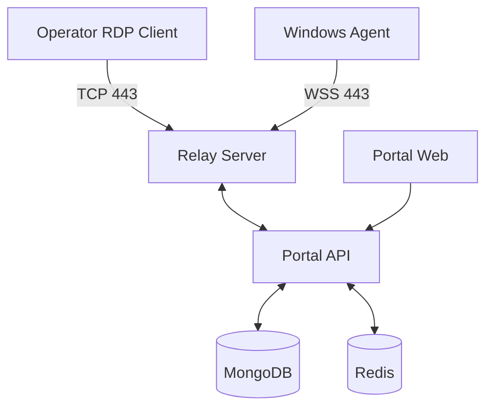

# 🚀 RDP Relay Platform

A comprehensive Remote Desktop Protocol (RDP) relay platform built with ASP.NET Core, enabling secure remote access through a centralized web portal with real-time session management and agent connectivity.

## ✨ Features

- 🌐 **Web-based Portal**: React frontend with Material-UI and real-time dashboard
- 🖥️ **Agent Management**: Windows agents for seamless target machine connectivity  
- 📊 **Real-time Monitoring**: Live session tracking and agent status updates
- 🔐 **Secure Architecture**: JWT authentication with encrypted WebSocket connections
- 🐳 **Docker Deployment**: Complete containerized solution with MongoDB and Redis
- 🔧 **Session Management**: Create, monitor, and terminate RDP sessions via web interface
- 📱 **Responsive Design**: Modern UI that works on desktop and mobile devices

## 🏗️ Architecture

```
┌─────────────────┐    ┌─────────────────┐    ┌─────────────────┐
│   Web Portal    │────│   Portal API    │────│   Relay Server  │
│   (React)       │    │  (ASP.NET Core) │    │  (ASP.NET Core) │
└─────────────────┘    └─────────────────┘    └─────────────────┘
                                                        │
                                              ┌─────────────────┐
                                              │   Windows Agent │
                                              │   (.NET Service)│
                                              └─────────────────┘
```

## 🚀 Quick Start

### Prerequisites
- Docker and Docker Compose
- Windows machine for agent deployment (optional for testing)

### 1. Clone Repository
```bash
git clone https://github.com/dev-hub-stack/rdp.git
cd rdp
```

### 2. Environment Setup
```bash
cp .env.example .env
# Edit .env with your configuration
```

### 3. Start Services
```bash
docker-compose up -d
```

### 4. Access Portal
- **Web Portal**: http://localhost:8080
- **Login**: `test@test.com` / `password`

### 5. Deploy Windows Agent (Optional)
```bash
# Extract agent installer
tar -xzf build/windows-agent-complete-reinstall.tar.gz

# On Windows machine, run as Administrator:
complete-reinstall.bat
```

## 📁 Project Structure

```
rdp-relay/
├── 📂 portal-web/          # React frontend application
├── 📂 portal-api/          # ASP.NET Core API backend  
├── 📂 relay/               # RDP relay server
├── 📂 agent-win/           # Windows agent service
├── 📂 scripts/             # Deployment and testing scripts
├── 📂 docs/                # Comprehensive documentation
├── 📂 infra/               # Infrastructure (nginx, certs)
├── 📂 build/               # Windows agent installers
└── 📂 tests/               # Test suites
```

## 🛠️ Development

### Frontend Development
```bash
cd portal-web
npm install
npm run dev
```

### Backend Development  
```bash
cd portal-api/RdpRelay.Portal.Api
dotnet run
```

### Build Windows Agent
```bash
./scripts/build-windows-agent.sh
```

## 🧪 Testing

### Run Platform Tests
```bash
./scripts/test-platform.sh
```

### Test Frontend Components
```bash
./scripts/test-frontend.sh
```

### Test Agent Connectivity
```bash
./scripts/test-agents-post-deployment.sh
```

## 📚 Documentation

| Document | Description |
|----------|-------------|
| [Quick Start Guide](docs/QUICK_START.md) | Get up and running in 5 minutes |
| [Architecture Guide](docs/TECHNICAL_ARCHITECTURE.md) | Detailed system architecture |
| [Deployment Guide](docs/DEPLOYMENT_OPERATIONS_GUIDE.md) | Production deployment |
| [API Reference](docs/COMPLETE_API_REFERENCE.md) | Full API documentation |
| [Troubleshooting](docs/TROUBLESHOOTING_GUIDE.md) | Common issues and solutions |

## 🔧 Configuration

### Environment Variables
```bash
# Database
MONGODB_CONNECTION_STRING=mongodb://localhost:27017/rdprelay
REDIS_CONNECTION_STRING=localhost:6379

# JWT Settings  
JWT_SIGNING_KEY=your-secret-key
JWT_ISSUER=RdpRelay
JWT_AUDIENCE=RdpRelayUsers

# Server Settings
RELAY_SERVER_URL=ws://localhost:5001
PORTAL_API_URL=http://localhost:5000
```

### Docker Compose Services
- **nginx**: Reverse proxy (port 8080)
- **portal-web**: React frontend (port 3000)
- **portal-api**: API backend (port 5000) 
- **relay-server**: RDP relay (port 5001, 9443)
- **mongodb**: Database (port 27017)
- **redis**: Cache (port 6379)

## 🐛 Troubleshooting

### Common Issues

**Portal not accessible?**
```bash
docker-compose ps  # Check service status
docker-compose logs nginx  # Check nginx logs
```

**Agents not connecting?**
```bash
# Check relay server logs
docker-compose logs relay-server

# On Windows agent machine
Get-Service RdpRelayAgent
```

**RDP connection fails?**
- Verify agent is "Online" in portal
- Check Windows RDP service is enabled
- Ensure port 9443 is accessible

## 🤝 Contributing

1. Fork the repository
2. Create a feature branch (`git checkout -b feature/amazing-feature`)
3. Commit your changes (`git commit -m 'Add amazing feature'`)
4. Push to the branch (`git push origin feature/amazing-feature`)
5. Open a Pull Request

## 📈 Status

✅ **Core Features Complete**
- Web portal with authentication
- Agent management and registration  
- Session creation and monitoring
- RDP relay infrastructure
- Windows agent service
- Docker deployment

✅ **Recent Fixes**
- Fixed session creation 500 errors
- Fixed connect code endpoint 404 errors
- Enhanced agent connection stability
- Improved frontend error handling

## 🎯 Roadmap

- [ ] Multi-tenant support
- [ ] Advanced session recording
- [ ] Mobile app support
- [ ] Advanced monitoring and analytics
- [ ] Load balancing for multiple relay servers

## 📄 License

This project is licensed under the MIT License - see the [LICENSE](LICENSE) file for details.

## 👥 Support

For support and questions:
- 📧 Create an issue in this repository
- 📖 Check the [documentation](docs/)
- 🔧 Review [troubleshooting guide](docs/TROUBLESHOOTING_GUIDE.md)

---

**Made with ❤️ for secure remote desktop access**

## Architecture Overview



## Components

- **Relay** - .NET 8 Kestrel server handling TCP/WebSocket multiplexing
- **Agent-Win** - .NET 8 Windows Service for NAT traversal
- **Portal-API** - .NET 8 Minimal API for tenant management and session brokering
- **Portal-Web** - React/TypeScript web interface
- **Infra** - Docker, systemd, and deployment configurations

## Quick Start

### Prerequisites
- .NET 8 SDK
- Docker and Docker Compose
- Node.js 18+

### Development Setup

1. Clone and setup:
```bash
git clone <repo-url>
cd rdp-relay
cp infra/env.example .env
# Edit .env with your settings
```

2. Start infrastructure:
```bash
docker-compose -f infra/docker-compose.dev.yml up -d mongo redis
```

3. Run Portal API:
```bash
cd portal-api
dotnet run
```

4. Run Relay:
```bash
cd relay
dotnet run
```

5. Run Portal Web:
```bash
cd portal-web
npm install
npm run dev
```

### Production Deployment

```bash
docker-compose -f infra/docker-compose.yml up -d
```

## Ports

- **443** - Relay (RDP clients + Agent WSS)
- **8443** - Portal Web/API (HTTPS)
- **22** - SSH (admin only)

## Environment Variables

See `.env.example` for complete configuration options.

Key variables:
- `MONGO_URI` - MongoDB connection string
- `REDIS_URI` - Redis connection string  
- `JWT_SIGNING_KEY` - JWT signing secret (32+ chars)
- `RELAY_PUBLIC_HOST` - Public hostname for relay

## Security

- TLS 1.2+ for all communications
- JWT-based session brokering with short TTLs
- Multi-tenant isolation
- Role-based access control
- Comprehensive audit logging

## Documentation

- [Threat Model](docs/THREAT_MODEL.md)
- [API Reference](docs/API.md)  
- [Deployment Guide](docs/DEPLOYMENT.md)
- [Runbooks](docs/RUNBOOKS.md)

## License

MIT License - see LICENSE file for details.
