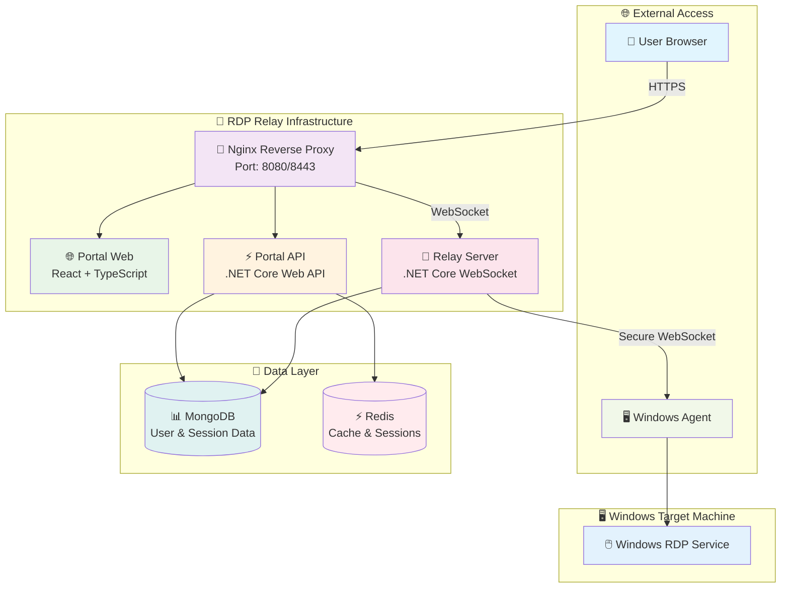
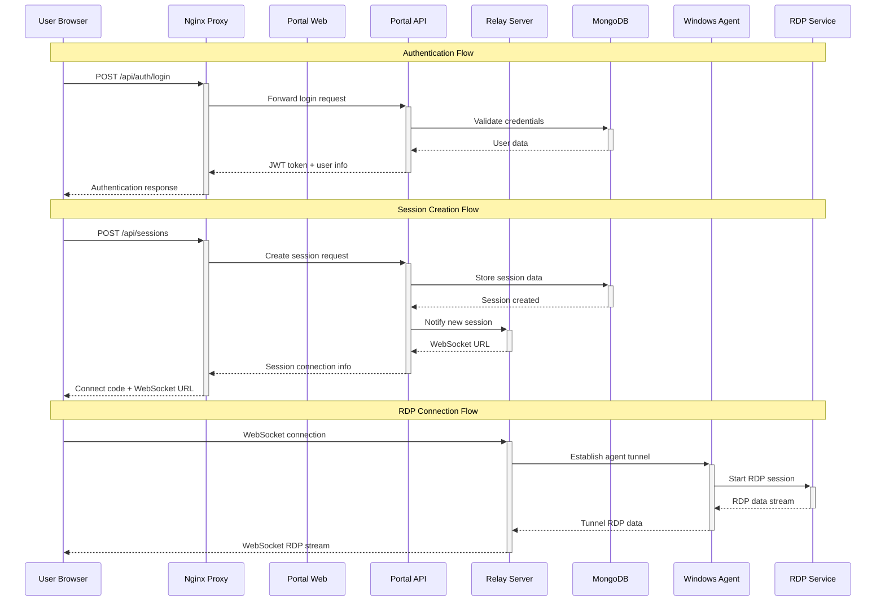
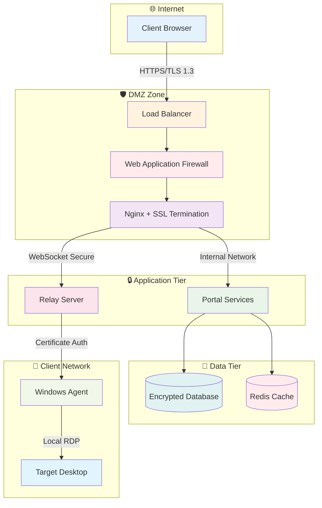
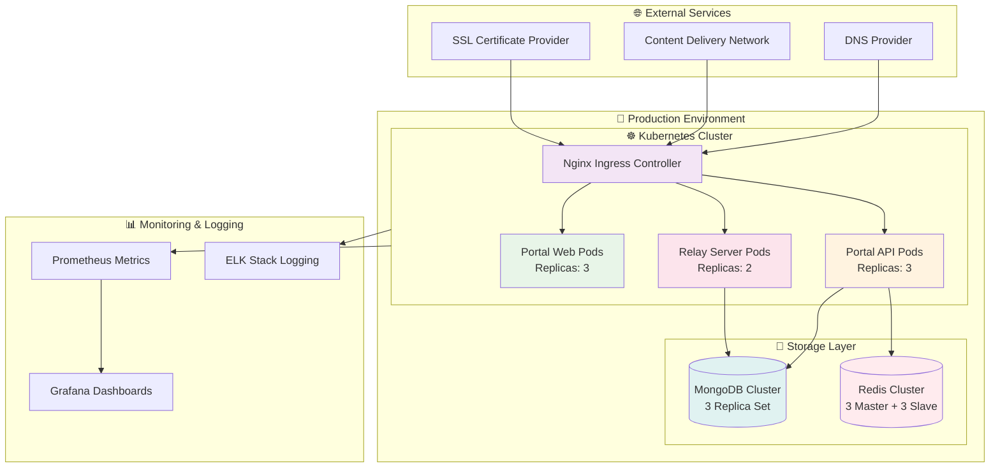

# 🏗️ RDP Relay Platform - Architecture Diagrams

## System Overview Diagram

```mermaid
flowchart TB
    subgraph External ["🌐 External Access"]
        User[👤 User Browser]
        WinAgent[🖥️ Windows Agent]
    end
    
    subgraph Infrastructure ["🏢 RDP Relay Infrastructure"]
        Nginx[🔄 Nginx Reverse Proxy<br/>Port: 8080/8443]
        PortalWeb[🌐 Portal Web<br/>React + TypeScript]
        PortalAPI[⚡ Portal API<br/>.NET Core Web API]
        RelayServer[🔗 Relay Server<br/>.NET Core WebSocket]
    end
    
    subgraph DataLayer ["💾 Data Layer"]
        MongoDB[(📊 MongoDB<br/>User & Session Data)]
        Redis[(⚡ Redis<br/>Cache & Sessions)]
    end
    
    subgraph WindowsMachine ["🖥️ Windows Target Machine"]
        RDPService[🖱️ Windows RDP Service]
    end
    
    User -->|HTTPS| Nginx
    Nginx --> PortalWeb
    Nginx --> PortalAPI
    Nginx -->|WebSocket| RelayServer
    
    PortalAPI --> MongoDB
    PortalAPI --> Redis
    RelayServer --> MongoDB
    RelayServer -->|Secure WebSocket| WinAgent
    WinAgent --> RDPService
    
    style User fill:#e1f5fe
    style Nginx fill:#f3e5f5
    style PortalWeb fill:#e8f5e8
    style PortalAPI fill:#fff3e0
    style RelayServer fill:#fce4ec
    style MongoDB fill:#e0f2f1
    style Redis fill:#ffebee
    style WinAgent fill:#f1f8e9
    style RDPService fill:#e3f2fd
```

## Data Flow Diagram

```mermaid
sequenceDiagram
    participant U as User Browser
    participant N as Nginx Proxy  
    participant W as Portal Web
    participant A as Portal API
    participant R as Relay Server
    participant M as MongoDB
    participant WA as Windows Agent
    participant RDP as RDP Service
    
    Note over U,RDP: Authentication Flow
    U->>+N: POST /api/auth/login
    N->>+A: Forward login request
    A->>+M: Validate credentials
    M-->>-A: User data
    A-->>-N: JWT token + user info
    N-->>-U: Authentication response
    
    Note over U,RDP: Session Creation Flow
    U->>+N: POST /api/sessions
    N->>+A: Create session request
    A->>+M: Store session data
    M-->>-A: Session created
    A->>+R: Notify new session
    R-->>-A: WebSocket URL
    A-->>-N: Session connection info
    N-->>-U: Connect code + WebSocket URL
    
    Note over U,RDP: RDP Connection Flow
    U->>+R: WebSocket connection
    R->>+WA: Establish agent tunnel
    WA->>+RDP: Start RDP session
    RDP-->>-WA: RDP data stream
    WA-->>-R: Tunnel RDP data
    R-->>-U: WebSocket RDP stream
```

## Component Architecture

```mermaid
flowchart LR
    subgraph Frontend ["🎨 Frontend Layer"]
        React[React 18 + TypeScript]
        MUI[Material-UI Components]
        Zustand[Zustand State Management]
        Axios[Axios HTTP Client]
    end
    
    subgraph Backend ["⚙️ Backend Layer"]
        WebAPI[ASP.NET Core Web API]
        JWT[JWT Authentication]
        MongoDB_Driver[MongoDB .NET Driver]
        Serilog[Serilog Logging]
    end
    
    subgraph Relay ["🔗 Relay Layer"]
        WebSocket_Hub[SignalR WebSocket Hub]
        Session_Manager[Session Manager]
        RDP_Tunnel[RDP Tunnel Service]
        Certificate_Service[Certificate Service]
    end
    
    subgraph Agent ["🖥️ Agent Layer"]
        Agent_Service[Windows Agent Service]
        WebSocket_Client[WebSocket Client]
        RDP_Manager[RDP Connection Manager]
        System_Info[System Info Service]
    end
    
    Frontend --> Backend
    Backend --> Relay
    Relay --> Agent
    
    style React fill:#61dafb
    style WebAPI fill:#512bd4
    style WebSocket_Hub fill:#0078d4
    style Agent_Service fill:#107c10
```

## Security Architecture

```mermaid
flowchart TB
    subgraph Internet ["🌐 Internet"]
        Client[Client Browser]
    end
    
    subgraph DMZ ["🛡️ DMZ Zone"]
        LoadBalancer[Load Balancer]
        Nginx[Nginx + SSL Termination]
        Firewall[Web Application Firewall]
    end
    
    subgraph AppTier ["🔒 Application Tier"]
        Portal[Portal Services]
        Relay[Relay Server]
    end
    
    subgraph DataTier ["💾 Data Tier"]
        DB[(Encrypted Database)]
        Cache[(Redis Cache)]
    end
    
    subgraph ClientNetwork ["🏢 Client Network"]
        Agent[Windows Agent]
        Desktop[Target Desktop]
    end
    
    Client -->|HTTPS/TLS 1.3| LoadBalancer
    LoadBalancer --> Firewall
    Firewall --> Nginx
    Nginx -->|Internal Network| Portal
    Nginx -->|WebSocket Secure| Relay
    Portal --> DB
    Portal --> Cache
    Relay -->|Certificate Auth| Agent
    Agent -->|Local RDP| Desktop
    
    style Client fill:#e3f2fd
    style LoadBalancer fill:#fff3e0
    style Firewall fill:#ffebee
    style Nginx fill:#f3e5f5
    style Portal fill:#e8f5e8
    style Relay fill:#fce4ec
    style DB fill:#e0f2f1
    style Cache fill:#ffebee
    style Agent fill:#f1f8e9
    style Desktop fill:#e1f5fe
```

## Deployment Architecture

```mermaid
flowchart TB
    subgraph Production ["🚀 Production Environment"]
        subgraph K8s ["☸️ Kubernetes Cluster"]
            Ingress[Nginx Ingress Controller]
            WebPods[Portal Web Pods<br/>Replicas: 3]
            APIPods[Portal API Pods<br/>Replicas: 3]
            RelayPods[Relay Server Pods<br/>Replicas: 2]
        end
        
        subgraph Storage ["💾 Storage Layer"]
            MongoDB_Cluster[(MongoDB Cluster<br/>3 Replica Set)]
            Redis_Cluster[(Redis Cluster<br/>3 Master + 3 Slave)]
        end
    end
    
    subgraph Monitoring ["📊 Monitoring & Logging"]
        Prometheus[Prometheus Metrics]
        Grafana[Grafana Dashboards]
        ELK[ELK Stack Logging]
    end
    
    subgraph External_Services ["🌐 External Services"]
        DNS[DNS Provider]
        CDN[Content Delivery Network]
        SSL_Provider[SSL Certificate Provider]
    end
    
    Ingress --> WebPods
    Ingress --> APIPods
    Ingress --> RelayPods
    
    APIPods --> MongoDB_Cluster
    APIPods --> Redis_Cluster
    RelayPods --> MongoDB_Cluster
    
    K8s --> Prometheus
    Prometheus --> Grafana
    K8s --> ELK
    
    DNS --> Ingress
    CDN --> Ingress
    SSL_Provider --> Ingress
    
    style Ingress fill:#f3e5f5
    style WebPods fill:#e8f5e8
    style APIPods fill:#fff3e0
    style RelayPods fill:#fce4ec
    style MongoDB_Cluster fill:#e0f2f1
    style Redis_Cluster fill:#ffebee
```
