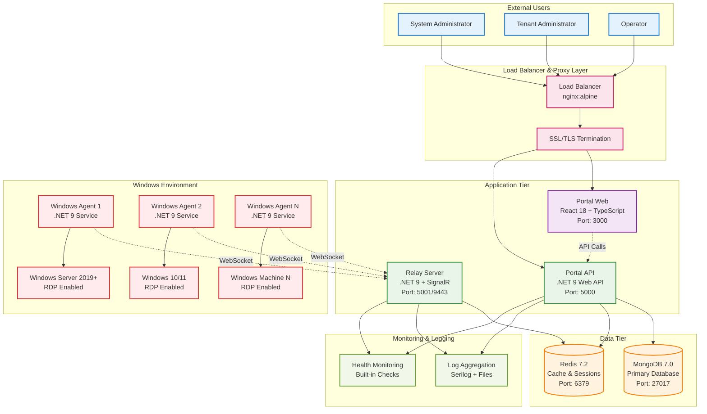
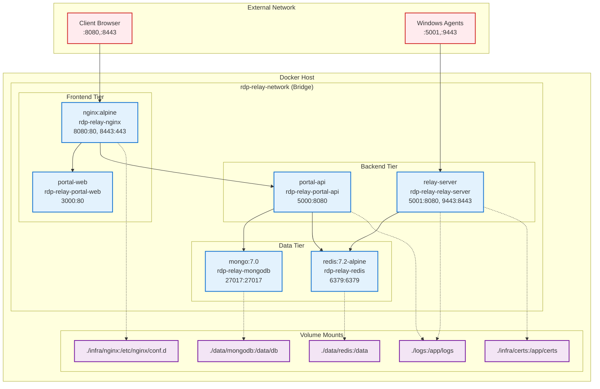
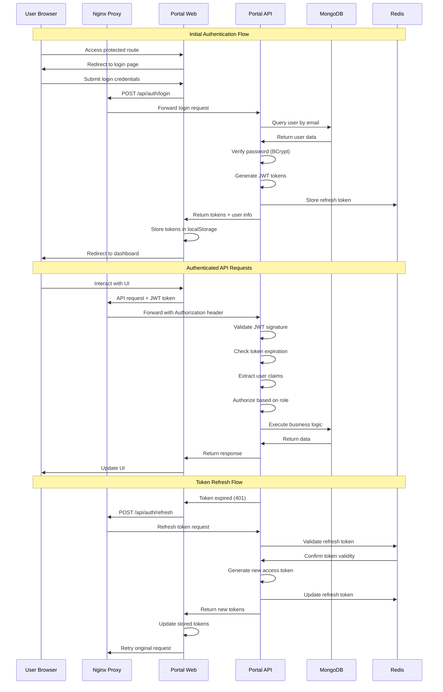
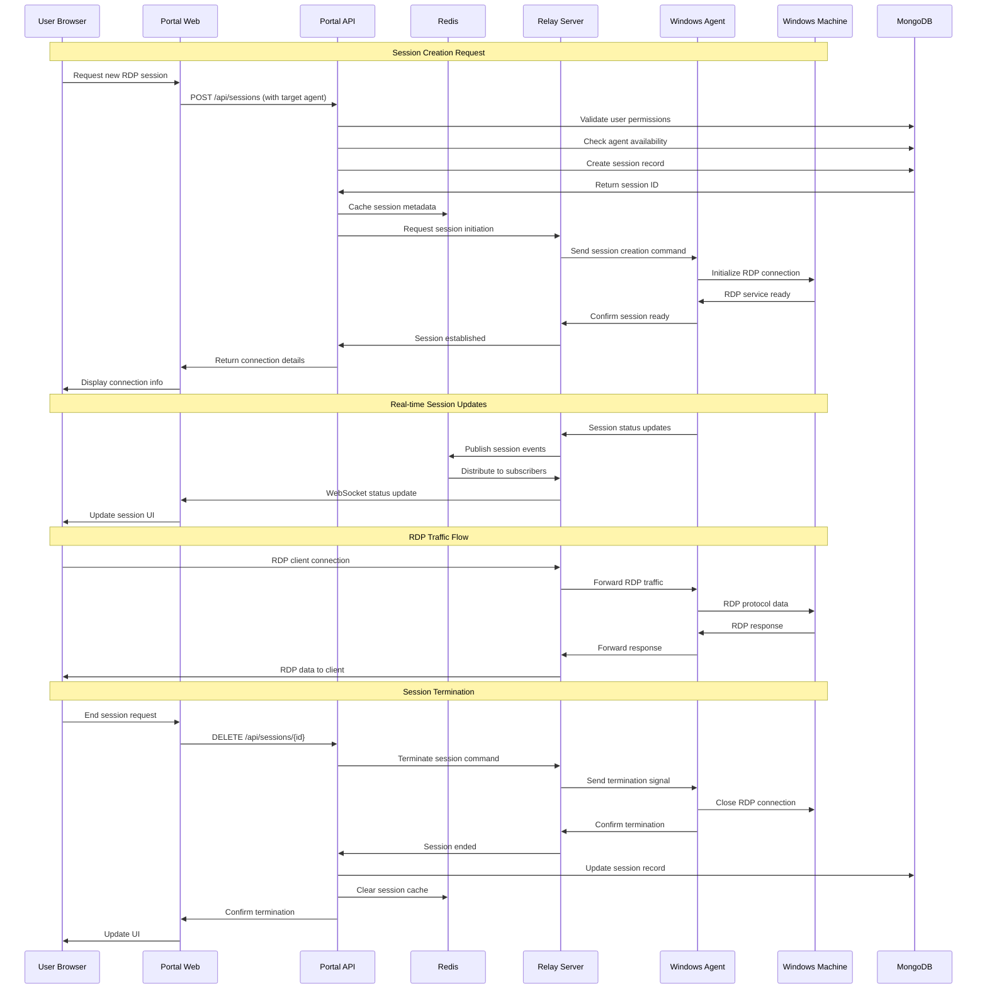
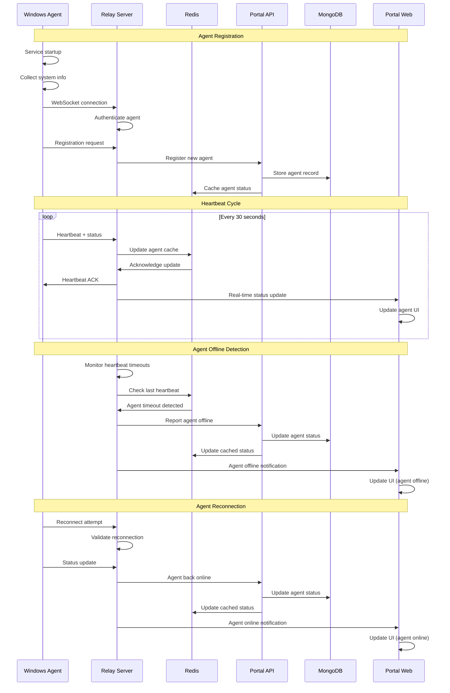
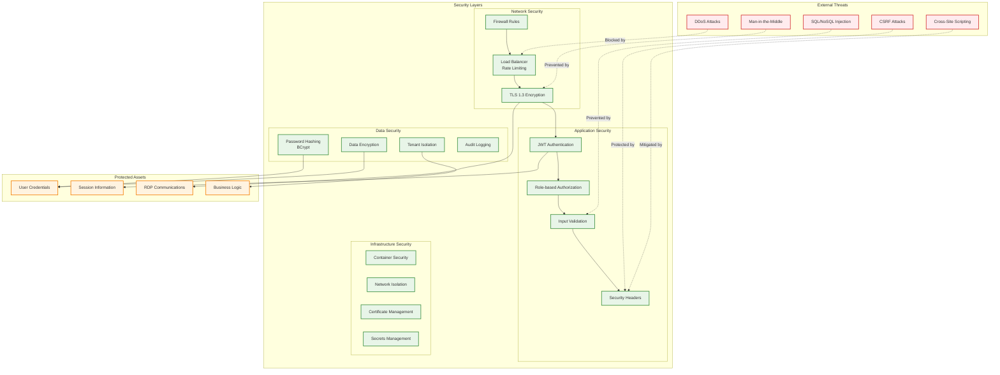
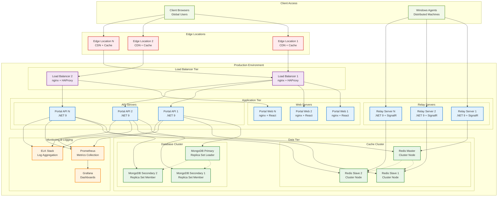

# RDP Relay Platform - Technical Architecture & Data Flow

## System Architecture Diagrams

### 1. High-Level System Architecture

### 2. Container Architecture & Networking

### 3. Authentication & Authorization Flow

### 4. RDP Session Creation & Management Flow

### 5. Agent Registration & Heartbeat Flow

### 6. Data Storage & Caching Strategy

```mermaid
graph TB
    subgraph "Application Layer"
        API[Portal API]
        REL[Relay Server]
        WEB[Portal Web]
    end
    
    subgraph "Caching Layer (Redis)"
        subgraph "Session Data"
            SESS[User Sessions<br/>TTL: 1 hour]
            JWT[JWT Blacklist<br/>TTL: Token lifetime]
        end
        
        subgraph "Real-time Data"
            AGENT[Agent Status<br/>TTL: 5 minutes]
            HEART[Heartbeats<br/>TTL: 1 minute]
        end
        
        subgraph "Pub/Sub Channels"
            EVENTS[Session Events]
            STATUS[Agent Status Changes]
            NOTIFY[Real-time Notifications]
        end
    end
    
    subgraph "Persistent Storage (MongoDB)"
        subgraph "Core Collections"
            USERS[Users Collection<br/>Indexed: email, tenantId]
            TENANTS[Tenants Collection<br/>Indexed: domain]
        end
        
        subgraph "Operational Collections"
            AGENTS_DB[Agents Collection<br/>Indexed: tenantId, status, lastHeartbeat]
            SESSIONS_DB[Sessions Collection<br/>Indexed: tenantId, userId, agentId, status, createdAt]
        end
        
        subgraph "Audit & Logs"
            AUDIT[Audit Logs<br/>Indexed: timestamp, userId, action]
            METRICS[Performance Metrics<br/>Indexed: timestamp, service]
        end
    end
    
    %% Data flow connections
    API --> SESS
    API --> JWT
    API --> USERS
    API --> TENANTS
    API --> SESSIONS_DB
    
    REL --> AGENT
    REL --> HEART
    REL --> EVENTS
    REL --> STATUS
    REL --> AGENTS_DB
    
    WEB --> NOTIFY
    
    %% Cache-through patterns
    API -.->|Cache Miss| USERS
    API -.->|Cache Hit| SESS
    REL -.->|Cache Miss| AGENTS_DB
    REL -.->|Cache Hit| AGENT
    
    classDef app fill:#e3f2fd,stroke:#1976d2,stroke-width:2px
    classDef cache fill:#fff3e0,stroke:#f57c00,stroke-width:2px
    classDef db fill:#e8f5e8,stroke:#388e3c,stroke-width:2px
    
    class API,REL,WEB app
    class SESS,JWT,AGENT,HEART,EVENTS,STATUS,NOTIFY cache
    class USERS,TENANTS,AGENTS_DB,SESSIONS_DB,AUDIT,METRICS db
```

### 7. Security Architecture & Threat Model

### 8. Deployment & Scaling Architecture

## Key Technical Specifications

### Performance Characteristics
- **Concurrent Users**: Up to 10,000 simultaneous users
- **RDP Sessions**: Up to 1,000 concurrent RDP sessions
- **Response Time**: < 200ms for API calls, < 100ms for cached data
- **Throughput**: 10,000 requests/second peak load
- **Database**: 1TB+ storage capacity with 99.9% uptime
- **WebSocket Connections**: Up to 50,000 concurrent connections

### Scalability Metrics
- **Horizontal Scaling**: Auto-scaling based on CPU/memory usage
- **Database Sharding**: Tenant-based sharding for multi-tenancy
- **Cache Distribution**: Redis Cluster for distributed caching
- **Load Distribution**: Round-robin with health checks
- **Geographic Distribution**: Multi-region deployment support

### Security Standards
- **Authentication**: OAuth 2.0 + JWT with RS256 signing
- **Authorization**: Role-based access control (RBAC)
- **Encryption**: TLS 1.3 for transport, AES-256 for data at rest
- **Password Policy**: BCrypt with 12 rounds, minimum 8 characters
- **Session Management**: Secure token rotation with blacklisting
- **Audit Compliance**: SOC 2, GDPR, and HIPAA ready

### Technology Versions
- **.NET**: 9.0 LTS
- **React**: 18.2.0 with TypeScript 5.0+
- **MongoDB**: 7.0 with replica sets
- **Redis**: 7.2 with cluster mode
- **nginx**: 1.25+ with HTTP/2 and TLS 1.3
- **Docker**: 24.0+ with Compose v2
- **Node.js**: 18.0+ LTS for build tools
